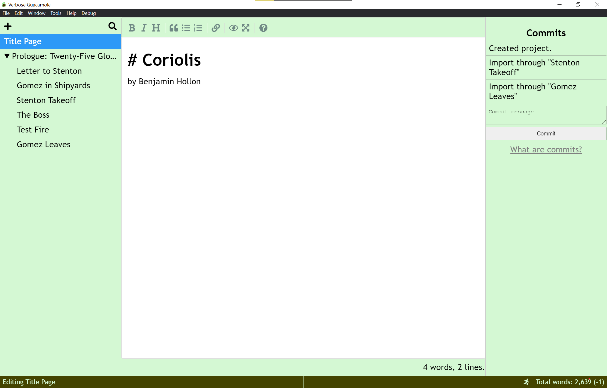

# verbose-guacamole
A editor for writers (especially novelists) powered by markdown and git.

## Features

### Markdown editing
All files are edited in Markdown, using [simplemde](https://simplemde.com/). The placeholder for an empty file is a random selection from a list of famous first sentences of novels.

### Project History
Because of VerbGuac's integration with Git, Version History is relatively easy to explore. As of v0.3.0, you can view past versions, revert to them, and even revert your reversions.

In the future, the Git integration is planned to be used to allow users to sync between devices.

### Word Sprints
Starting in v0.2.2, words sprints are built in. Pressing the icon of a runner in the Novel Stats toolbar will pop up a box where you can set the sprint time.

A pie chart representing the time left will replace the running icon during a sprint.

### Filesystem
VerbGuac projects are split into files, which can be separated into folders. >=v0.1.1 supports file and folder creating, renaming, moving, editing, and deleting. Open folders and files are also maintained between open sessions.

### Whimsy
We've done our best to fill VerbGuac with as much whimsy as possible, including witty loading comments and editor placeholders that are famous first lines from novels.

If you have an idea for a way to make the VerbGuac experience fun, let us know!

### The Future
VerbGuac is still under development. Future features include:

- Syncing a project from a remote repository
- Support for non-text files such as images
- Exporting to popular eBook formats
- Multilingual support
- Support for custom Javascript extensions and CSS themes, possibly with an official database of endorsed extensions and themes.

## Screenshots

## License
Verbose Guacamole is released under the [GPL-3.0](./LICENSE) license.
