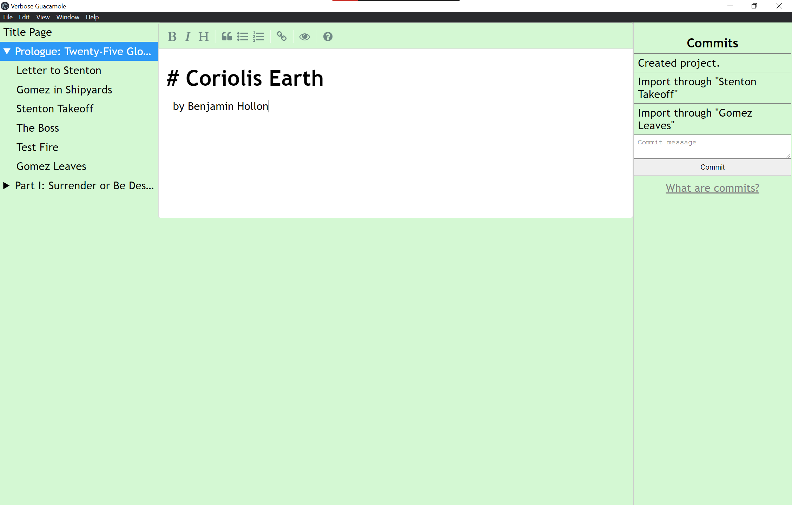

# verbose-guacamole
A editor for writers (especially novelists) powered by markdown and git.

## Features

### Markdown editing
All files are edited in Markdown, using [simplemde](https://simplemde.com/). The placeholder for an empty file is a random selection from a list of famous first sentences of novels.

Spellcheck is currently disabled.

### Git Integration
Git is used for version control via [simple-git](https://github.com/steveukx/git-js). As of v0.1.0, commits can be created. More features related to this are planned.

### Filesystem
VerbGuac projects are split into files, which can be separated into folders. v0.1.1 supports file and folder creating, renaming, moving, editing, and deleting. Open folders are also maintained between open sessions.

### The Future
VerbGuac is still under development. Future features include:

- Viewing and restoring file history from past commits
- Syncing a project from a remote repository
- Adding novel details
- Spellcheck!
- Support for custom Javascript plugins and CSS themes, possibly with an official database of endorsed plugins and themes.

## Screenshots

## License
Verbose Guacamole is released under the [GPL-3.0](./LICENSE) license.
